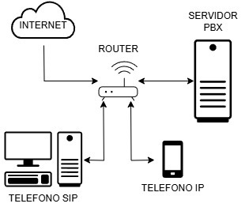
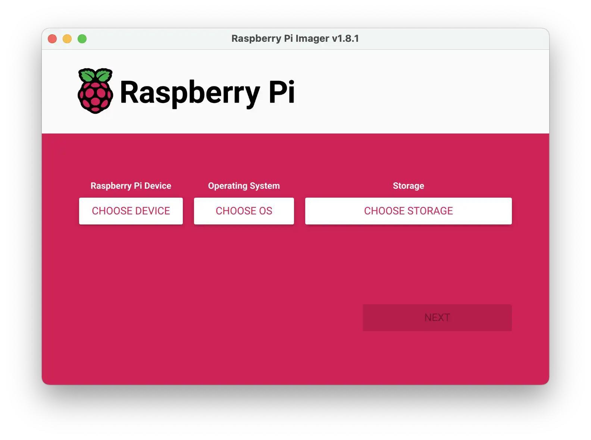
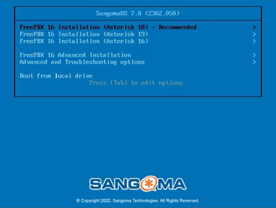
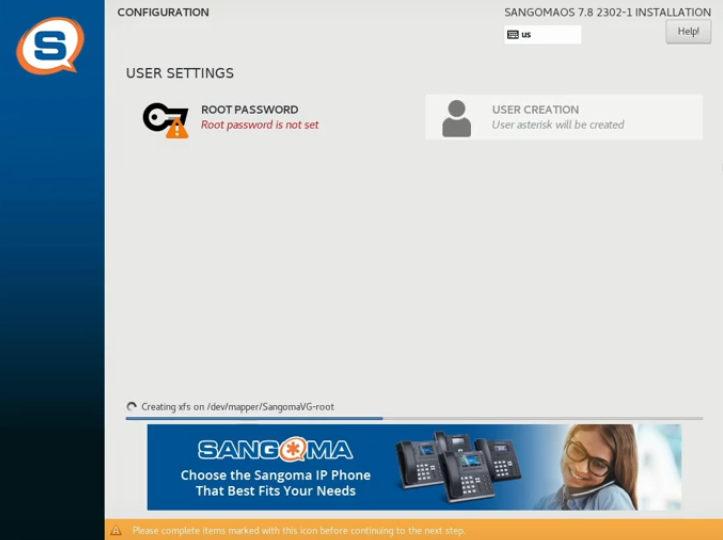
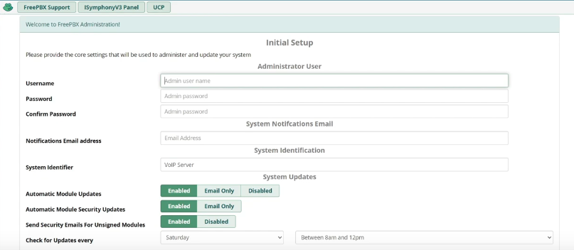
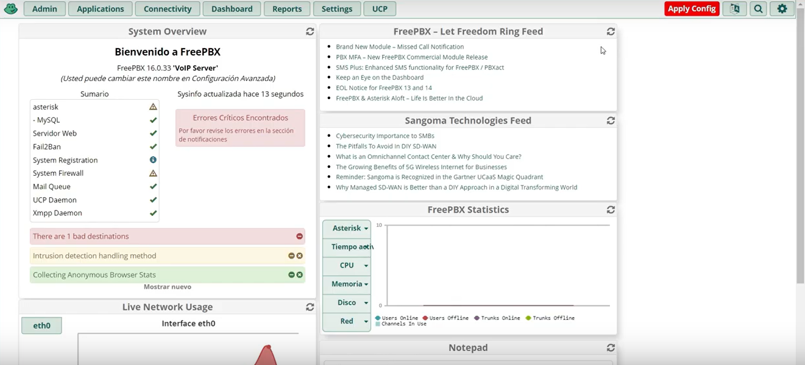
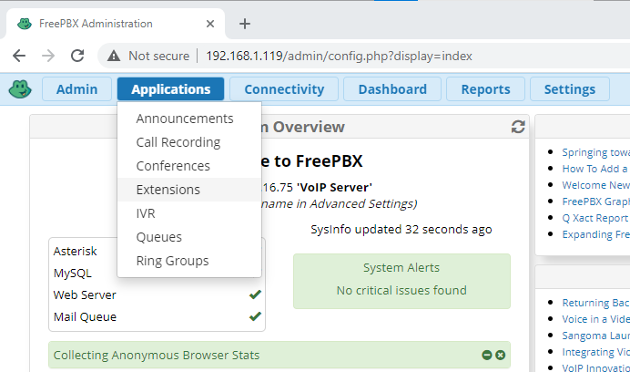
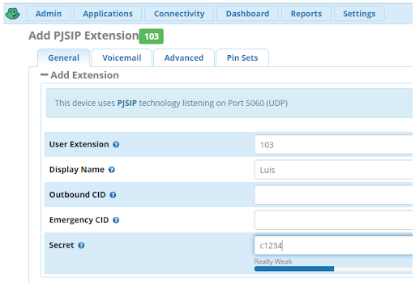
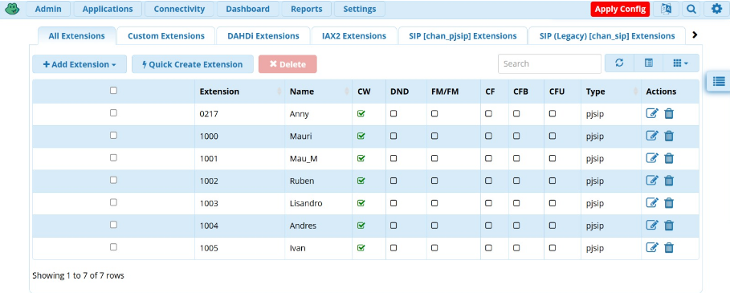
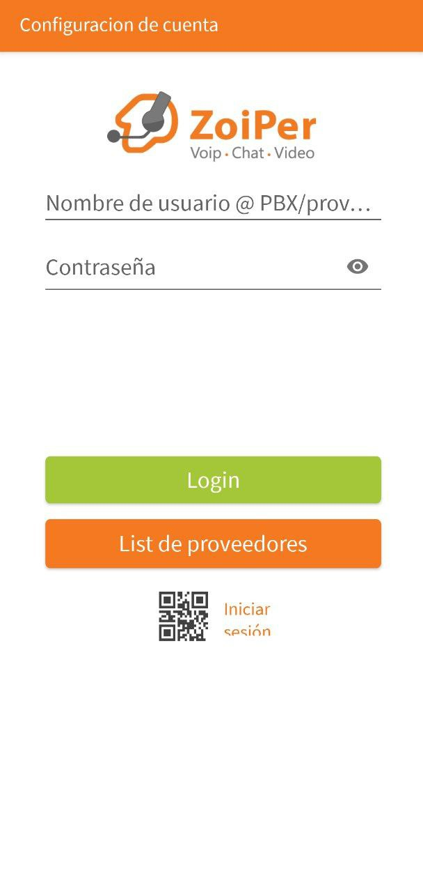

 # Universidad Nacional de Córdoba 

## Facultad de Ciencias Exactas, Físicas y Naturales

### Sistemas de Comunicaciones Telefónicas
### **Central Telefónica VoIP con Raspberry Pi**

-------

### Grupo: <strong> Transmitiendo Facts </strong>

### Integrantes:
  - Airaudo, Andrés
  - Cabero, Mauro
  - Mora, Iván
  - Morán, Mauro
  - Nuñez, Anna
  - Testa, Lisandro
  - Zúñiga, Guillermo Rubén Darío

# Introducción

En la actualidad, las comunicaciones basadas en tecnología VoIP (Voice over IP) han revolucionado la forma en que se transmiten las llamadas telefónicas, permitiendo reducir costos, mejorar la flexibilidad y facilitar la integración con otros sistemas informáticos. Este informe describe la implementación de una central VoIP basada en Asterisk y FreePBX sobre una plataforma Raspberry Pi, un dispositivo de bajo costo y consumo energético. El sistema instalado permite gestionar comunicaciones internas y externas mediante el uso del protocolo SIP (Session Initiation Protocol), incluyendo la configuración de un servidor proxy y el registro de extensiones SIP para la realización de llamadas entre usuarios locales y hacia el exterior.

# Esquema general

- **Router**:
Es el centro de la red local, donde se conectan todos los dispositivos (por cable o Wi-Fi). Asigna IPs a todos los dispositivos por DHCP.

- **Servidor PBX**
Es un servidor donde está instalado RasPBX (Asterisk + FreePBX). Se conecta al router y forma parte de la red local. Es el que gestiona las llamadas, extensiones y servicios telefónicos.

Teléfono SIP (computadora + softphone)
Es un dispositivo (una PC) que utiliza un programa (como Zoiper, MicroSIP o Linphone) para actuar como teléfono SIP.
Se conecta al router y se registra como extensión en el servidor PBX.

Teléfono IP (posiblemente un smartphone): Es un teléfono (puede ser físico o una app en un celular como Zoiper o Linphone).

Si conectás el PBX a un proveedor VoIP, podrías hacer llamadas externas (opcional).

# Instalacion de FreePBX

Se descargó la imagen ISO de FreePBX de la [página oficial](https://www.freepbx.org/sngfd12/) y luego se lamontó en una tarjeta SD mediante el software Raspberry Pi Imager.

Luego se insertó la SD a la Raspberry y se seleccionó la versión recomendada de FreePBX con la opción de instalación gráfica. Mientras se instala, se puede cambiar la contraseña de inicio en `Root Password`.

Luego de la instalación, se reinició la placa y se inició sesión con el usuario `root` y la contraseña configurada anteriormente. La instalación está completa.

# Configuración

## FreePBX

Se observó que la placa posee una dirección IP, que si se ingresa a la misma mediante un navegador, se pueden realizar todas las configuraciones de administración gracias a la GUI de FreePBX.

Para el setup inicial se colocó el nombre de usuario y contraseña y se establecieron las siguientes opciones:

- `Automatic Module Updates`: Deshabilitado
- `Automatic Module Security Updates`: Solo Email
- `Send Security Emails for Unsigned Modules`: Habilitado

Luego de continuar, se inició sesion en `FreePBX Administration` y se habilitaron todas las características del firewall de Sangoma.

Una vez logueado como administrador se tiene la capacidad de añadir extensiones. Se inició el formulario desde la opción de `Applications > Extensions`.

La configuración más adecuada para hacer una conexión sencilla sin tener que hacer configuraciones adicionales en nuestros elementos de red como abrir puertos, es el tipo SIP. Y preferiblemente la versión 'chan_pjsip' por compatibilidad con programas _softphone_.

En el formulario de la configuración de la extensión, sólo se tuvo que rellenar los tres campos imprescindibles del número de extensión, nombre y clave.

Tras pulsar el botón de Submit. Esta nueva entrada se añadió a la lista de extensiones. Pero hasta que no se apliquen los cambios pulsando Apply Config, esta configuración no quedará guardada. Si la Raspberry Pi es un modelo antiguo (3 o 2) el proceso puede tardar más de un minuto.

## Softphone

Para este caso se escogió instalar Zoiper, en equipos celulares.

Tras ejecutar el programa y aceptar su uso bajo licencia o libre, se solicitó la IP del servidor Asterisk anteriormente configurado para comprobar la conectividad.

Si se obtiene verde en el protocolo UDP, se podrá pasar a añadir una cuenta (account) desde el botón `Add`.

La configuración es tan simple como colocar la IP de la Raspberry Pi en el campo _Domain_ el user name coincide con la extensión y el _Password_ registrado anteriormente en la consola de administración de FreePBX.

Cuando la aplicación se conecte con el servidor, aparecerá el símbolo de ok en color verde pudiendo enviar y recibir llamadas.

El registro de todas las llamadas queda reflejado en la parte derecha de la aplicación.

# Conclusión

El desarrollo de esta central VoIP implementada sobre Raspberry Pi con Asterisk y FreePBX resultó una solución económica, flexible y de bajo consumo, fácil de administrar vía GUI y compatible con softphones como Zoiper. Además, permitió observar el funcionamiento de distintos protocolos de comunicación y demostrar la viabilidad de montar una central telefónica IP funcional y económica, adecuada tanto para entornos educativos como empresariales de pequeña escala.